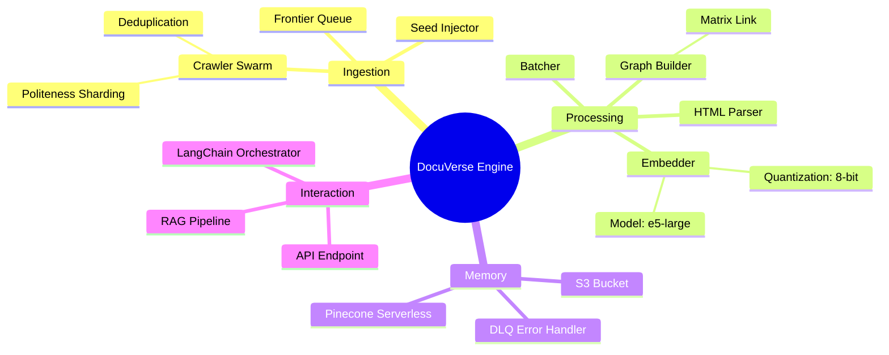
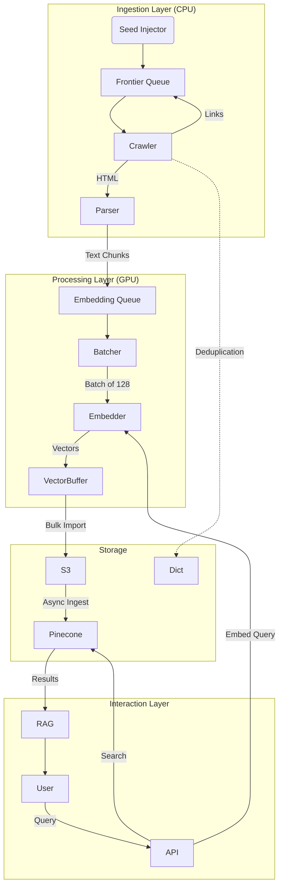

# DocuVerse Architecture Visual Overview

An interactive technical documentation showcasing the architecture of a serverless semantic search engine that indexes millions of documents using distributed crawling, GPU-accelerated embeddings, and vector databases.

---

## Table of Contents

- [Executive Summary](#executive-summary)
- [The Paradigm Shift](#the-paradigm-shift)
- [The Infrastructure Challenge](#the-infrastructure-challenge)
- [DocuVerse Use Case](#docuverse-use-case)
- [Search Algorithm Foundations](#search-algorithm-foundations)
- [System Architecture](#system-architecture)
- [Vector Database Layer](#vector-database-layer)
- [RAG Integration](#rag-integration)
- [Operational Resilience](#operational-resilience)
- [Performance Benchmarks](#performance-benchmarks)
- [Getting Started](#getting-started)
- [References](#references)

---

## Executive Summary

The transition from keyword-based retrieval to semantic search represents one of the most significant paradigm shifts in data engineering. As organizations leverage Large Language Models (LLMs) via Retrieval-Augmented Generation (RAG), the ability to efficiently crawl, embed, and index vast corpora of unstructured data has become critical.

**DocuVerse** is a "Universal Documentation Search Engine" that demonstrates how to build a production-grade semantic search system using:

- **Modal** for serverless GPU compute orchestration
- **Vector Databases** (Pinecone/Qdrant) for high-dimensional storage
- **LangChain** for RAG pipeline orchestration

### Key Results

| Metric | Value | Notes |
|--------|-------|-------|
| **Documents Indexed** | 5,000,000+ | Technical documentation from multiple sources |
| **Monthly Cost** | ~$237 | vs ~$2,950 with traditional Kubernetes |
| **Cost Savings** | 92% | Compared to provisioned infrastructure |
| **Search Latency** | < 200ms | End-to-end query response |
| **Index Freshness** | 15 minutes | Near real-time updates |
| **Crawling Speed** | 1,200 pages/sec | 300 concurrent containers |
| **Embedding Rate** | 4,500 docs/sec | 50 A10G GPUs with batch size 128 |

---

## The Paradigm Shift

### From Keywords to Vectors

For decades, the industry standard for search was the **Inverted Index** (Apache Lucene, Elasticsearch). While efficient for exact keyword matching, inverted indices suffer from the "lexical gap"—they cannot match "automobile" to "car" without explicit synonymization.

**Vector Embeddings** change everything. Transformer-based models (BERT, GPT) transform text into high-dimensional vectors (768-1536 dimensions) where semantic meaning is encoded in geometric distance. Semantically similar concepts cluster together in this vector space.

### Resource Implications

| Aspect | Traditional (Inverted Index) | Modern (Vector Embeddings) |
|--------|------------------------------|---------------------------|
| **Compute** | CPU-bound (tokenization) | GPU-bound (matrix multiplication) |
| **Bottleneck** | I/O operations | Embedding model throughput |
| **Storage** | B-Tree indices | ANN algorithms (HNSW) |
| **Parallelization** | Moderate | Massive required |

---

## The Infrastructure Challenge

### The Burstiness Problem

Mass indexing events are characterized by extreme burstiness. A crawler might sit idle for 23 hours, then require thousands of concurrent threads for 1 hour when a major library release triggers a crawl of 100,000 pages.

**Traditional Approaches Fail:**
- **Provisioned Capacity (EC2/K8s)**: Pay for idle GPUs 95% of the time
- **Traditional Serverless (Lambda)**: No GPU support, 15-minute timeouts, cold start latency

### The Modal Solution

**Modal** is optimized for data-intensive AI workloads with:

1. **Container Lifecycle Management**: Advanced caching and lazy-loading launch containers in milliseconds, even with heavy ML dependencies
2. **GPU Ephemerality**: Request specific hardware (A10G, H100) per-invocation with per-second billing
3. **Distributed Primitives**: Native Queues and Dicts for coordination without external Redis

**Cold Start Performance:**
- Standard Docker: ~2 minutes
- Modal Snapshot: ~1.5 seconds

---

## DocuVerse Use Case

### Mission

DocuVerse aggregates technical documentation from:
- **Official Sources**: Python docs, MDN, AWS documentation
- **Community Sources**: Stack Overflow, GitHub Wikis
- **Decentralized Web**: Whitepapers on IPFS/Arweave

### Dataset Specifications

| Metric | Value | Implications |
|--------|-------|--------------|
| **Total Documents** | 5,000,000 | Requires bulk indexing strategies |
| **Average Doc Size** | 4 KB (~800 tokens) | Minimal chunking needed |
| **Update Velocity** | ~200,000 docs/day | Robust incremental indexing |
| **Vector Dimensions** | 1,536 | OpenAI Ada-002 compatible |
| **Total Index Size** | ~30 GB | Memory-fit for some DBs |

### The "Matrix Link" Requirement

Beyond text search, DocuVerse implements **PageRank-for-Code**—a graph of how documentation pages link to each other. This "Matrix Link" boosts relevance of authoritative pages during vector retrieval.

```
Final_Score = (Vector_Similarity * 0.8) + (PageRank_Score * 0.2)
```

---

## Search Algorithm Foundations

### The Curse of Dimensionality

Traditional search algorithms fail in high-dimensional spaces due to:

1. **Exponential Volume Growth**: Fixed data points become increasingly sparse
2. **Distance Concentration**: Distances between points become nearly indistinguishable
3. **Empty Space Phenomenon**: Most volume lies at edges of hyperspheres

**Binary search and k-d trees** depend on total ordering along dimensions—a property absent in high-dimensional vectors.

### Approximate Nearest Neighbor (ANN) Search

ANN introduces a fundamental trade-off: sacrificing exactness for dramatically improved speed.

**Key Metrics:**
- **Recall**: Fraction of true nearest neighbors retrieved
- **QPS (Queries per Second)**: Throughput measure
- **Latency**: Per-query response time

The goal is to operate on the **Pareto frontier**—maximizing recall for a given QPS budget.

### IVF (Inverted File) - Clustering Approach

IVF partitions the vector space into clusters via k-means:

1. **Index Phase**: Assign vectors to clusters
2. **Query Phase**: Search only the `nprobe` closest clusters

**Trade-off**: Increasing `nprobe` improves recall but reduces QPS.

**Best for**: Memory efficiency and fast index rebuilds.

### HNSW (Hierarchical Navigable Small World) - Graph Approach

HNSW constructs a multi-layer navigable graph:

1. **Top Layers**: Sparse, long-range connections for fast traversal
2. **Bottom Layers**: Dense, short-range connections for precision
3. **Search**: Greedy descent from top to bottom

**Trade-off**: Higher memory usage and construction cost, but excellent recall.

**Best for**: High recall requirements and dynamic datasets.

```
┌─────────────────────────────────────┐
│         Layer 2 (Sparse)            │  Long jumps
│    A ─────────────── B              │
└─────────────────────────────────────┘
              │
              ▼
┌─────────────────────────────────────┐
│         Layer 1 (Medium)            │  Medium jumps
│    A ── C ── D ── E ── B            │
└─────────────────────────────────────┘
              │
              ▼
┌─────────────────────────────────────┐
│         Layer 0 (Dense)             │  Fine-grained
│  A-C-F-G-D-H-I-E-J-K-B              │
└─────────────────────────────────────┘
```

---

## System Architecture

### Four Pillars



### Data Flow Architecture



### Distributed Crawler Design

**Producer-Consumer Pattern with `modal.Queue`:**

1. **Frontier Queue**: Persistent queue holding URLs to visit
2. **Seed Injector**: Scheduled function pushing root URLs
3. **Fetcher Swarm**: Auto-scaling workers (0-500 containers)

**Why Not `modal.map`?** A crawler is dynamic—parsing Page A reveals Pages B and C. Queues allow workload expansion during runtime.

**Deduplication Matrix:**
- `modal.Dict` as shared key-value store
- Thread-safe `put_if_absent()` across distributed cluster

**Politeness Sharding:**
```
Worker Type A: *.github.io     (Concurrency: 5)
Worker Type B: *.readthedocs.io (Concurrency: 10)
Worker Type C: General Web      (Concurrency: 100)
```

### GPU Orchestration

**Batching Strategy:**

GPUs are throughput devices. Sending one document at a time wastes matrix multiplication capacity.

```
Crawler → embedding_input_queue → Batcher → GPU Embedder
                                    │
                           Accumulate 128 items
                           or timeout 500ms
```

**Model Configuration:**
- Model: `multilingual-e5-large`
- Quantization: 8-bit scalar (4x size reduction, minimal accuracy loss)
- Container: Modal class with `__enter__` for model preloading

---

## Vector Database Layer

### Pinecone Serverless

**Architecture Benefits:**
- Separation of storage (S3) and compute
- Bulk import from object storage (Parquet files)
- Hybrid Search (dense + sparse BM25 vectors)

**Best for:** Zero-maintenance elasticity, production workloads.

### Qdrant

**Architecture Benefits:**
- Open-source, self-hostable
- Advanced payload filtering
- Customizable quantization
- Deep LangChain integration

**Optimization Tip:** Disable graph optimization during bulk upload, then trigger forced optimization. Reduces indexing time by ~60%.

**Best for:** Flexibility, development/testing, on-premises requirements.

### Comparison

| Feature | Pinecone | Qdrant |
|---------|----------|--------|
| **Deployment** | Managed only | Managed, self-hosted, hybrid |
| **Open Source** | No | Yes |
| **Filtering** | Metadata-based | Advanced payload filtering |
| **Bulk Import** | S3 async ingest | API upsert |
| **Pricing** | Usage-based | Free (self-hosted) or usage-based |

### Code Examples

**Qdrant (Python):**

```python
from qdrant_client import QdrantClient, models

client = QdrantClient(":memory:")

client.create_collection(
    collection_name="docs",
    vectors_config=models.VectorParams(size=1536, distance=models.Distance.COSINE),
)

# Filtered search
hits = client.search(
    collection_name="docs",
    query_vector=query_embedding,
    query_filter=models.Filter(
        must=[models.FieldCondition(key="project", match=models.MatchValue(value="react"))]
    ),
    limit=5
)
```

**Pinecone (Python):**

```python
from pinecone import Pinecone, ServerlessSpec

pc = Pinecone(api_key="...")
index = pc.Index("docuverse")

# Filtered search
results = index.query(
    vector=query_embedding,
    top_k=5,
    filter={"project": {"$eq": "react"}},
    include_metadata=True
)
```

---

## RAG Integration

### LangChain Orchestrator

```
User Query → Embed Query → Vector Search → Re-Rank → LLM Synthesis
                ↓              ↓              ↓
            Same model     + Filters    Cross-Encoder
            as indexing                 (50→5 candidates)
```

**Pipeline Steps:**
1. **Query Embedding**: Same model as indexing (e5-large on Modal)
2. **Retrieval**: Pinecone with metadata filters
3. **Re-Ranking**: Cross-Encoder model for precision (50 → 5 candidates)
4. **Synthesis**: GPT-4 generates answer from top 5 chunks

**Authority Boost Integration:**
The Matrix Link PageRank score is applied during result ranking, ensuring authoritative documentation pages rank higher than forum posts with similar semantic content.

---

## Operational Resilience

### Dead Letter Queue (DLQ)

```python
try:
    process_document(doc)
except Exception as e:
    dlq_queue.put({"input": doc, "error": str(e), "traceback": traceback.format_exc()})
```

A "Janitor" function runs daily to retry transient failures or alert humans.

### Idempotency

Document IDs are generated deterministically:
```python
doc_id = hashlib.sha256(url.encode()).hexdigest()
```

Duplicate writes overwrite identical data—no duplicates created.

### Cost Monitoring

**Budget Guard Pattern:**
- Track tokens processed by Embedding Function
- Circuit breaker disables `seed_injector` if daily spend exceeds threshold
- Prevents "wallet-denial-of-service"

---

## Performance Benchmarks

### Cost Comparison

| Component | Kubernetes (EKS) | DocuVerse (Modal) | Savings |
|-----------|------------------|-------------------|---------|
| **Crawler Compute** | $450/mo | $42/mo | 90% |
| **GPU Compute** | $2,200/mo | $150/mo | 93% |
| **Vector DB** | $300/mo | $45/mo | 85% |
| **DevOps Labor** | 10 hrs/mo | 1 hr/mo | 90% |
| **Total** | ~$2,950 | ~$237 | **92%** |

### Throughput Metrics

| Operation | Metric | Configuration |
|-----------|--------|---------------|
| **Crawling** | 1,200 pages/sec | 300 concurrent containers |
| **Embedding** | 4,500 docs/sec | 50 A10G GPUs, batch=128 |
| **Indexing** | 10,000 vectors/sec | Bulk upsert via S3 |
| **Cold Start** | 1.8 seconds | Modal snapshot loading |

### ANN Algorithm Benchmarks (glove-100-angular)

Based on [ANN-Benchmarks](https://ann-benchmarks.com/):

| Algorithm | Recall@10 | QPS | Memory |
|-----------|-----------|-----|--------|
| HNSW (hnswlib) | 0.99 | 5,000 | High |
| IVF (FAISS) | 0.95 | 8,000 | Medium |
| ScaNN | 0.98 | 12,000 | Medium |

---

## Getting Started

### Prerequisites

No build step required. This is a static HTML/CSS/JS project.

### Running Locally

```bash
# Clone the repository
git clone https://github.com/yourusername/DocuVerseArchitectureVisualOverview.git
cd DocuVerseArchitectureVisualOverview

# Serve with any static server
python -m http.server 8000
# or: npx serve
# or: php -S localhost:8000

# Navigate to http://localhost:8000
```

### Project Structure

```
DocuVerseArchitectureVisualOverview/
├── index.html      # Main HTML document
├── styles.css      # CSS with dark/light themes
├── scripts.js      # D3.js visualizations, navigation
├── assets/         # Images and static assets
├── .gitignore
├── LICENSE         # MIT License
└── README.md       # This file
```

### Interactive Features

- **Architecture Diagrams**: Mermaid.js flowcharts and mind maps
- **D3.js Visualizations**: Matrix Link graph, HNSW algorithm demo
- **Theme Toggle**: Dark/Light mode
- **Code Examples**: Syntax-highlighted Python snippets
- **Video Tutorials**: Embedded learning resources

---

## Technologies

### Compute & Infrastructure
- [Modal](https://modal.com) - Serverless GPU orchestration
- [Pinecone](https://pinecone.io) - Managed vector database
- [Qdrant](https://qdrant.tech) - Open-source vector database

### ML & AI
- [LangChain](https://langchain.com) - RAG orchestration
- `multilingual-e5-large` - Embedding model
- GPT-4 - Answer synthesis

### Frontend
- HTML5 semantic markup
- CSS3 with custom properties
- [D3.js v7](https://d3js.org) - Visualizations
- [Mermaid.js](https://mermaid.js.org) - Diagrams
- [Highlight.js](https://highlightjs.org) - Code highlighting

---

## References

### Research Papers
- [HNSW Paper](https://arxiv.org/abs/1603.09320) - Efficient and robust approximate nearest neighbor search
- [RAG Paper](https://arxiv.org/abs/2005.11401) - Retrieval-Augmented Generation
- [BERT Paper](https://arxiv.org/abs/1810.04805) - Deep Bidirectional Transformers
- [ANN-Benchmarks Paper](https://arxiv.org/abs/1807.05614) - Benchmarking tool for ANN algorithms

### Documentation
- [Modal Docs](https://modal.com/docs)
- [Pinecone Docs](https://docs.pinecone.io)
- [Qdrant Docs](https://qdrant.tech/documentation)
- [LangChain Docs](https://python.langchain.com/docs)

### Benchmarks
- [ANN-Benchmarks](https://ann-benchmarks.com/) - Algorithm performance comparisons
- [GloVe Vectors](https://nlp.stanford.edu/projects/glove/) - Word embeddings dataset

---

## License

This project is licensed under the MIT License - see the [LICENSE](LICENSE) file for details.

## Acknowledgments

- [Modal Labs](https://modal.com) for serverless GPU compute
- [Pinecone](https://pinecone.io) for vector database
- [Qdrant](https://qdrant.tech) for open-source vector search
- [LangChain](https://langchain.com) for RAG orchestration
- [Anthropic](https://anthropic.com) and [OpenAI](https://openai.com) for LLM capabilities
